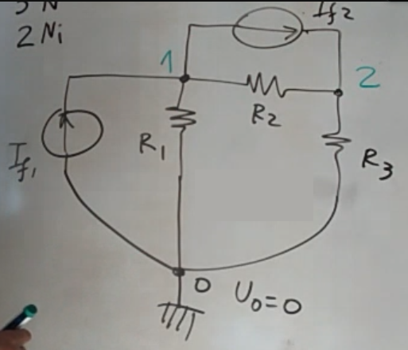
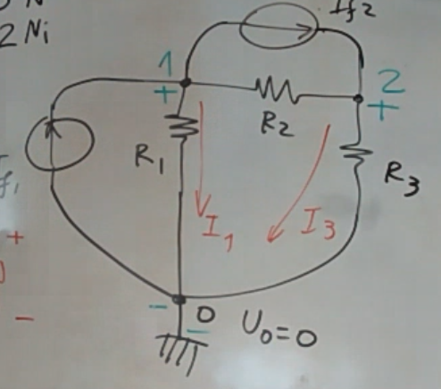
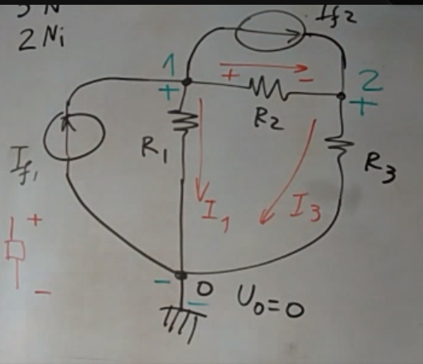
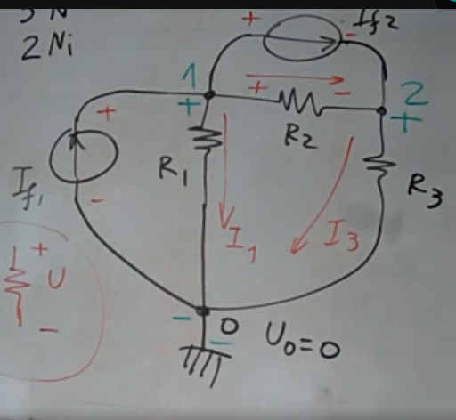
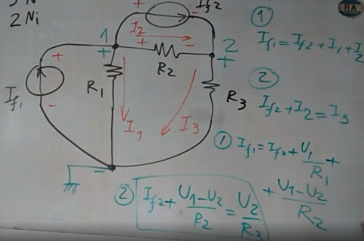
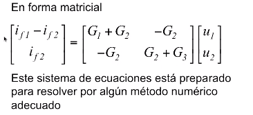
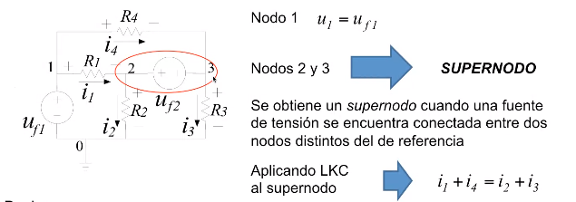

# Apuntes de Clase 2

## Análisis Nodal
Al revisar cuáles son las incógnitas del circuito, encontramos en general que se deben hallar las corrientes y tensiones en resistores, pero debe analizarse también si al mirar conexiones serie y paralelo hay resultados que se repetirán.

Por ejemplo, si una resistor está en **paralelo** con una fuente, JUSTIFICAREMOS que el resistor estará sometido a la misma tensión que la fuente por tal motivo. También se podría justificar por 2da Ley de Kirchoff, pero resulta muy trivial (evitar esta forma).

* Importante: en este método asignaremos UN VALOR DE TENSIÓN A CADA NODO.

### Polaridad de la tensión en elementos pasivos
Establecemos como **positivo** por donde ingresa la corriente, y **negativo** por donde sale. 

* Importante: una fuente de corriente ESTABLECE SOLO EL SENTIDO DE I DE SU RAMA, es decir, no puedo asegurar nada de los sentidos de corrientes de los otros elementos.

* Atención: la tensión en una fuente de corriente puede llegar a quedar al revés que su polaridad (es decir, quedaría el negativo en la punta de la flecha). En este caso, la fuente recibiría energía en lugar de entregarla (CONFIRMADO 19/3 14hs)

Sin embargo, pueden aparecer problemas como en la siguiente figura, donde para R2 quedó "positivo" en ambos extremos (nodos antes definidos cuando se hizo R1 y R3). Entonces, acá es cuando se **SUPONE un sentido de la corriente**, viendo cuál de los extremos es "más positivo que el otro".  

En rojo quedaron los SUPUESTOS.

Vemos en la Figura 3 una suposición para R2. De esta manera, suponemos que el **potencial** en el Nodo 2 es MENOR que el potencial del Nodo 1.

## Polaridad de la tensión en elementos activos
El signo de la tensión de las fuentes queda supuesta por los signos en los nodos:

Vemos que para este ejemplo, quedó supuesto que la fuente 1 entrega energía, y la fuente 2 recibe.

### Resolución
UNA VEZ HECHO TODO ESTE ANÁLISIS ESTOY EN CONDICIONES DE APLICAR LA 1RA LEY DE KIRCHOFF EN EL NODO 1 y 2. Luego voy reemplazando las corrientes por expresiones de la Ley de Ohm (salvo las que son dato, en general, solo reemplazamos las de los elementos pasivos)

Dejamos las corrientes/tensiones de las fuentes de un lado de las igualdades, y los términos con incógnitas del otro lado. Reemplazamos las R por G (conductancia) para evitar la escritura de varios denominadores, de modo que el sistema matricial quede más simplificado a la vista. 

### Supernodo
Si entre dos nodos independientes (es decir, ninguno de ellos es U0, el de referencia, ya que sería al pepe porque vale 0) hay una **fuente de TENSIÓN IDEAL** (SOLO ESO y nada más) decimos que ambos nodos forman un supernodo. ¿Y para que me sirve? Bueno, permite aplicar la 1ra Ley de Kirchoff directamente de esta forma:

  

## Análisis de Malla
Dual al anterior, tiene algunas limitaciones pero quedan menos ecuaciones (por algo me enseñaron directamente esto ._. XD)

### Supermalla
Si dos mallas comparten una fuente de corriente entremedio, se puede suprimir la rama donde se encuentra ésta para analizar una supermalla. PERO, no debemos olvidar que en una parte de la malla la corriente tendrá un valor y en la otra parte otro valor vinculado con la corriente de If conocida por 1° Ley de Kirchoff.

## Método de superposición (último recurso)
En circuitos lineales, lo que se hace es hacer los cálculos trabajando de una fuente por vez. Para anular una fuente de tensión (U=0) se realiza un cortocircuito donde ésta se encuentre. Para anular una fuente de corriente (I=0) se reemplaza por un "tramo abierto". Luego, para el resultado final sumo algebraicamente todas las superposiciones. Esto último debe realizarse con cuidado porque las corrientes pueden tener diferente sentido en cada caso.

## Método de Thevenin y Norton
Para un circuito del tipo **dipolo activo lineal**, para el 1° método se puede reemplazar el circuito por una fuente de tensión (Uth) y una resistencia (Rth), conectado a dos puntos A y B (tramo abierto), que al conectarlos circula una corriente Icc. En el 2° método, se reemplaza el circuito por una fuente de corriente (In) y una conductancia (Gn), en paralelo a un cortocircuito. Las incógnitas se obtienen por Ley de Ohm en ambos casos.

## Divisor de tensión y corriente
Midiendo sobre un elemento de circuito, por ejemplo, la tensión de un resistor en un circuito serie compuesto por varios resistores, por Ley de Ohm se puede conocer la tensión de la fuente. Similarmente, midiendo la corriente en una conductancia de un circuito paralelo de conductancias, se puede determinar la corriente de la fuente. Esto tiene aplicaciones, por ejemplo, en Puente de Whitstone (o como se escriba), para conocer la tensión en el "entremedio del rombo" (ver filminas para el desarrollo).

## No confundir
* El sentido de la corriente en una rama con la polaridad de la fuente (pueden ser diferentes)
* Un supernodo NO puede contener una resistencia junto a la fuente, como en este caso:

